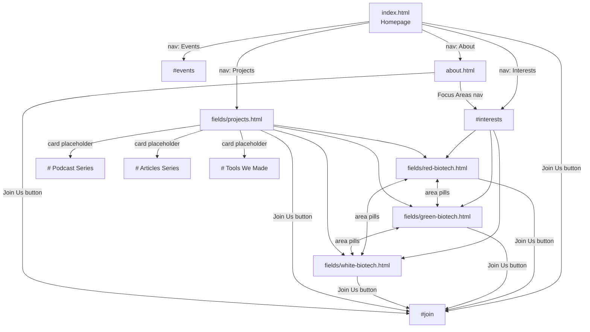

# BE Club — Full Site Map
 


 some junk 


       <div class="key-point">
        <h4>Governance and Regulation</h4>
        <p>Scientific progress often outpaces regulation, requiring international collaboration to establish frameworks that support innovation while ensuring responsible stewardship.</p>
      </div>
> Biotechnology Engineering Club website for ENSBiotech, Algeria.  
> Static HTML/CSS/JS — no build step required.

---

## 1. Project structure

```
beclub/
├── index.html                  # Homepage
├── about.html                  # About, mission, contact
├── SITE_MAP.md                 # This file
├── README.md
│
├── css/
│   └── style.css               # Shared stylesheet (all pages)
│
├── js/
│   └── typewriter.js           # Hero title animation
│
├── pics/
│   ├── podcast.svg             # Projects — Podcast Series icon
│   ├── articles.svg            # Projects — Articles Series icon
│   └── tools.svg               # Projects — Tools We Made icon
│
├── fields/
│   ├── red-biotech.html        # Red biotechnology focus area
│   ├── green-biotech.html      # Green / agricultural biotechnology
│   ├── white-biotech.html      # White / industrial biotechnology
│   └── projects.html           # Club projects hub
│
└── Articles/
    └── Article_core.html       # Empty — article template (planned)
```

---

## 2. Site navigation map



---

## 3. Global navigation

Same pattern on every page. **Join Us** is always a separate button — not part of the link list.

| Nav link (label) | `index.html` | `about.html` | `fields/*.html` |
|------------------|--------------|--------------|-----------------|
| Interests / Focus Areas | `#interests` | `index.html#interests` | `../index.html#interests` |
| Events | `#events` | `index.html#events` | `../index.html#events` |
| Projects | `fields/projects.html` | `fields/projects.html` | `projects.html` |
| About | `about.html` | `about.html` (active) | `../about.html` |
| **Join Us** (button) | `#join` | `index.html#join` | `../index.html#join` |

**Stylesheet paths**

| Location | CSS path |
|----------|----------|
| Root pages (`index.html`, `about.html`) | `css/style.css` |
| `fields/` pages | `../css/style.css` |

**Fonts (all pages)**  
Google Fonts: [Bebas Neue](https://fonts.googleapis.com/css2?family=Bebas+Neue&family=Inter:wght@400;500;600;700&display=swap) + Inter

---

## 4. Page-by-page breakdown

### 4.1 `index.html` — Homepage

| Section | ID / anchor | Status | Content |
|---------|-------------|--------|---------|
| Nav | — | Live | Logo, 4 links, Join Us button |
| Hero | — | Live | Typewriter title “BE Smart”, tags, CTA buttons |
| Stats bar | — | **Commented out** | 60+ members, 24 projects, 12 events/year |
| Focus Areas grid | `#areas` | **Commented out** | 6-area grid (replaced by Interests list) |
| Our Interests | `#interests` | Live | 3 linked cards → field pages |
| Events | `#events` | Live | 1 upcoming event (others commented out) |
| Join / Membership | `#join` | Live | Apply button, contact info, social links |
| Footer | — | Live | Logo, copyright, Instagram / Facebook / LinkedIn |

**Interests → field pages**

| # | Name | Link |
|---|------|------|
| 01 | Red Biotechnology | `fields/red-biotech.html` |
| 02 | Agricultural Biotechnology | `fields/green-biotech.html` |
| 03 | Industrial Biotechnology | `fields/white-biotech.html` |

**Scripts:** `js/typewriter.js` (`.typewriter` on hero title)

**External links (join section)**

| Channel | URL |
|---------|-----|
| Email | `mailto:beclub@enbiotech.edu.dz` |
| Instagram | https://www.instagram.com/b.e.club |
| Facebook | https://www.facebook.com/BiotechnologyEngineeringClub |
| Location | https://www.google.com/maps/place/ENBiotech |

---

### 4.2 `about.html` — About

| Section | ID | Status | Content |
|---------|-----|--------|---------|
| Page header | — | Live | Breadcrumb, typewriter “about us”, intro |
| Mission & Values | — | Live | 3 cards: Mission, Vision, Community |
| Focus Areas | `#areas` | Live | 6-area grid (not linked to field pages) |
| Our Interests | — | **Commented out** | Duplicate of homepage interests |
| Follow Us | — | Live | Instagram, Facebook, Email cards |
| Contact Us | — | Live | Email, social, ENSBiotech map link |
| Footer | — | Live | Back to home link |

**Scripts:** `js/typewriter.js`

**Note:** Email appears as both `beclub@enbiotech.edu.dz` (index) and `beclub@ensbiotech.edu.dz` (about) — may need unifying.

---

### 4.3 `fields/projects.html` — Club Projects

| Section | Status | Content |
|---------|--------|---------|
| Page header | Live | Breadcrumb, “CLUB PROJECTS” title, description |
| What We Make | Live | 3 project cards (see below) |
| Back bar | Live | Home link + focus area pills |
| Footer | Live | Standard field-page footer |

**Project cards** (links are placeholders `#`)

| Card | Icon | Tag | CTA |
|------|------|-----|-----|
| Podcast Series | `pics/podcast.svg` | Series | Listen → |
| Articles Series | `pics/articles.svg` | Series | Read → |
| Tools We Made | `pics/tools.svg` | Tools | Explore → |

**Cross-links:** Red / Green / White biotech via area pills in back bar.

---

### 4.4 `fields/red-biotech.html` — Red Biotechnology

| Section | Content |
|---------|---------|
| Header | 🩸 · Medical biotech · badge “Biotech · Medical” |
| Overview — What is it? | Definition + 4 key points (Gene Therapy, Monoclonal Antibodies, Biopharmaceuticals, Regenerative Medicine) |
| Articles & Resources | 6 article cards (mix of `#` placeholders + NIH, Khan Academy external) |
| What We Do | 4 club activities (Seminars, Case Studies, Lab Practicals, Paper Reviews) |
| Back bar | → index interests · pills to Green & White |

---

### 4.5 `fields/green-biotech.html` — Green Biotechnology

| Section | Content |
|---------|---------|
| Header | 🌱 · Agricultural biotech · badge “Biotech · Agriculture” |
| Overview — What is it? | Definition + 4 key points (GMO Crops, Biofertilizers, Pest Resistance, Sustainable Agriculture) |
| Articles & Resources | 6 article cards (placeholders + FAO, Nature external) |
| What We Do | 4 club activities |
| Back bar | → index interests · pills to Red & White |

---

### 4.6 `fields/white-biotech.html` — White Biotechnology

| Section | Content |
|---------|---------|
| Header | ⚗️ · Industrial biotech · badge “Biotech · Industrial” |
| Overview — What is it? | Definition + 4 key points (Industrial Fermentation, Enzyme Engineering, Metabolic Engineering, Bioplastics) |
| Articles & Resources | 6 article cards (placeholders + EuropaBio external) |
| What We Do | 4 club activities |
| Back bar | → index interests · pills to Red & Green |

---

### 4.7 `Articles/Article_core.html` — Article template

| Status | Notes |
|--------|-------|
| **Empty / planned** | Intended template for the Articles Series; not linked from anywhere yet |

---

## 5. Assets

### 5.1 `pics/` — Project icons

| File | Used on | Description |
|------|---------|-------------|
| `podcast.svg` | `fields/projects.html` | Microphone in circle (64×64) |
| `articles.svg` | `fields/projects.html` | Document with text lines |
| `tools.svg` | `fields/projects.html` | Terminal / code window |

Displayed inside `.project-card-icon` (72×72px box, `object-fit: contain`).

### 5.2 `css/style.css` — Stylesheet sections

| # | Section | Scope |
|---|---------|-------|
| 1 | Variables | Colors, fonts, spacing, transitions |
| 2 | Reset & Base | Global typography, scrollbar |
| 3 | Shared Components | Buttons, tags, typewriter caret |
| 4 | Layout | Nav, sections, breadcrumb, footer |
| 5 | Index Page | Hero, stats, areas, events, join |
| 6 | About Page | Page header, mission, follow, contact |
| 7 | Fields Pages | Header inner, overview, articles, activities, back bar, project icons |
| 8 | Mobile Overrides | Breakpoint `@media (max-width: 860px)` |

**Theme tokens (key colors)**

| Token | Value | Use |
|-------|-------|-----|
| `--red` | `#E60000` | Accent, buttons, labels |
| `--black` | `#0a0a0a` | Page background |
| `--dark` | `#121212` | Cards, sections |
| `--card` | `#222222` | Hover states |
| `--border` | `#333333` | Dividers, borders |
| `--white` | `#f5f5f5` | Primary text |
| `--muted` | `#888888` | Secondary text |

**Fonts:** Bebas Neue (headings) · Inter (body)

### 5.3 `js/typewriter.js`

| Target | Pages | Behavior |
|--------|-------|----------|
| `.typewriter` | `index.html`, `about.html` | Types out hero/page title character by character; respects `prefers-reduced-motion` |

---

## 6. Link graph (all internal routes)

```
index.html
  ├── #interests
  ├── #events
  ├── #join
  ├── about.html
  └── fields/
        ├── red-biotech.html
        ├── green-biotech.html
        ├── white-biotech.html
        └── projects.html

about.html
  ├── index.html
  ├── index.html#interests
  ├── index.html#events
  ├── index.html#join
  └── fields/projects.html

fields/*.html
  ├── ../index.html
  ├── ../index.html#interests
  ├── ../index.html#events
  ├── ../index.html#join
  ├── ../about.html
  ├── projects.html (within fields/)
  └── sibling field pages (red ↔ green ↔ white)
```

---

## 7. Placeholders & work in progress

| Item | Location | Status |
|------|----------|--------|
| Stats section | `index.html` | Commented out |
| Old 6-area grid | `index.html` | Commented out (`#areas`) |
| Extra interest items (AI, Bioinformatics) | `index.html` | Commented out |
| Extra events | `index.html` | Commented out |
| Interests section duplicate | `about.html` | Commented out |
| Article links on field pages | `fields/*-biotech.html` | Most use `href="#"` |
| Project card links | `fields/projects.html` | All use `href="#"` |
| Podcast / Articles / Tools destinations | — | Not built yet |
| `Articles/Article_core.html` | `Articles/` | Empty template |
| LinkedIn footer link | `index.html` | `href="#"` |
| Email domain consistency | index vs about | `enbiotech` vs `ensbiotech` |

---

## 8. How to add a new page

1. Copy `<nav>` and `<footer>` from an existing page in the same folder depth.
2. Add stylesheet:
   - Root: `<link rel="stylesheet" href="css/style.css" />`
   - Subfolder: `<link rel="stylesheet" href="../css/style.css" />`
3. Use `.section`, `.sec-label`, `.sec-title` for content blocks.
4. For a field-style page, reuse classes from **Fields Pages** in `style.css` (`.page-header`, `.header-inner`, `.overview-grid`, etc.).
5. Update nav links on all other pages if adding a top-level section.

---

## 9. Quick reference — URLs to open locally

| Page | Path |
|------|------|
| Home | `/index.html` |
| About | `/about.html` |
| Projects | `/fields/projects.html` |
| Red Biotech | `/fields/red-biotech.html` |
| Green Biotech | `/fields/green-biotech.html` |
| White Biotech | `/fields/white-biotech.html` |

---

*Last updated: June 2026 — reflects current repo state.*
